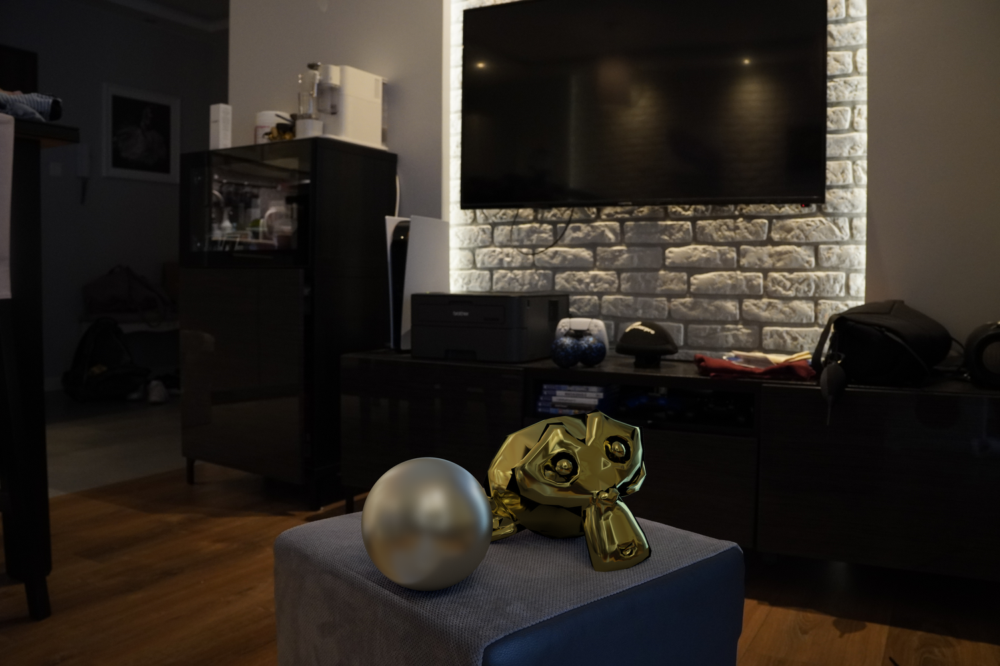
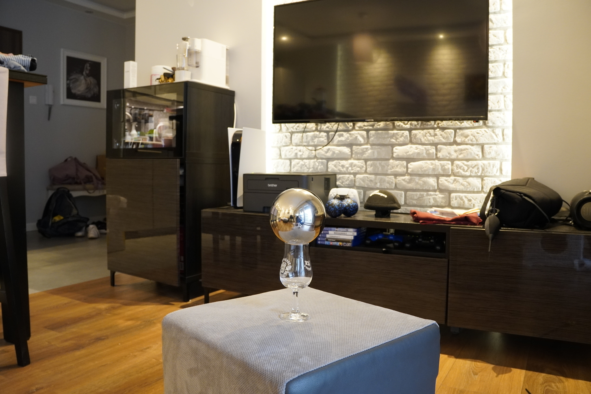
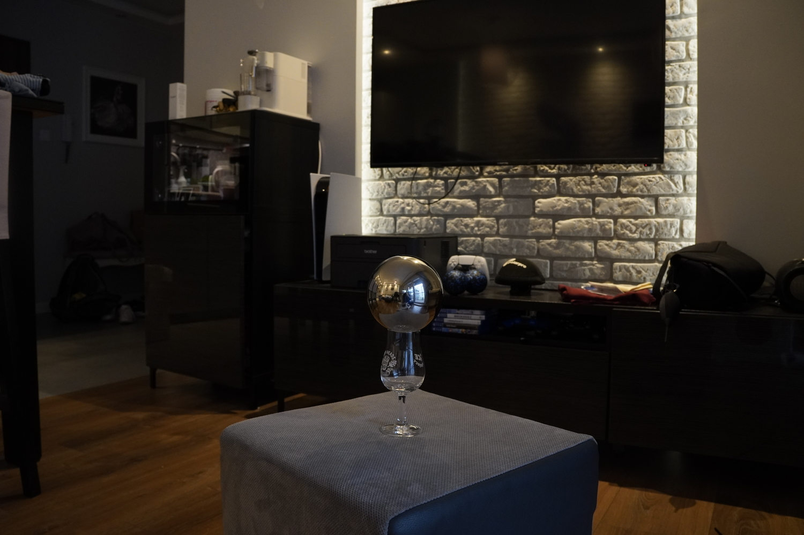
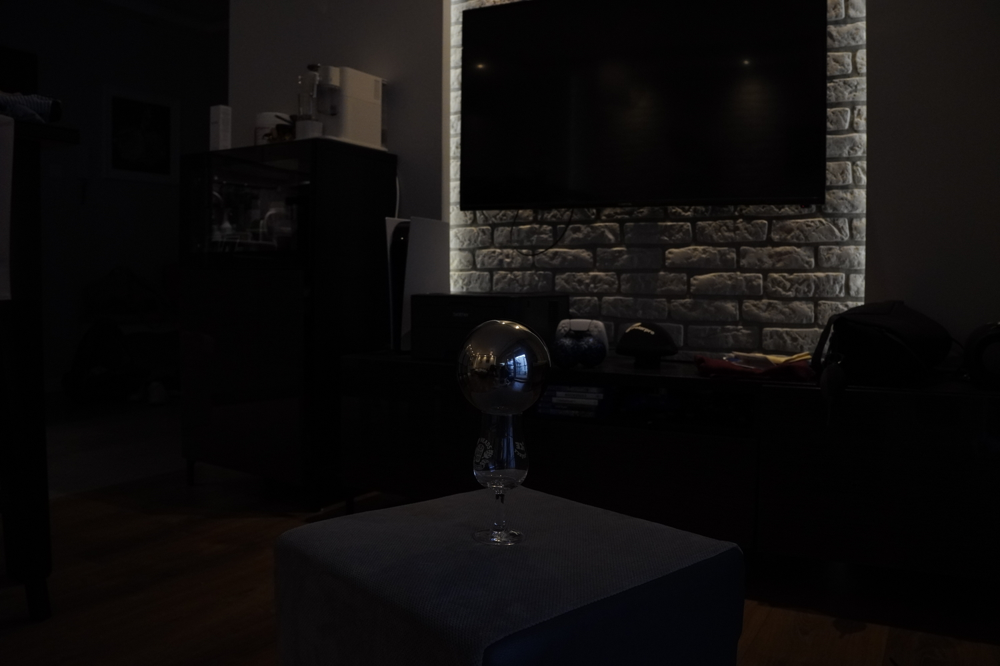
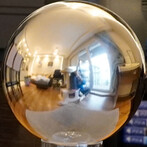
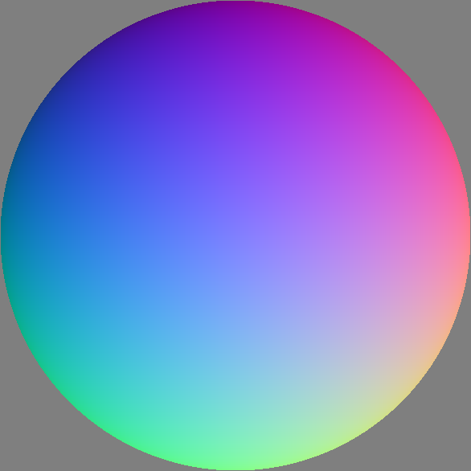
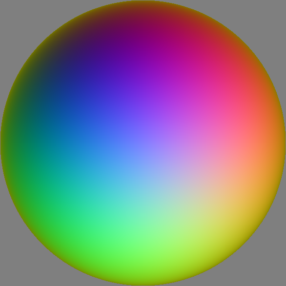
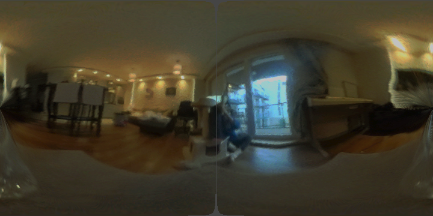
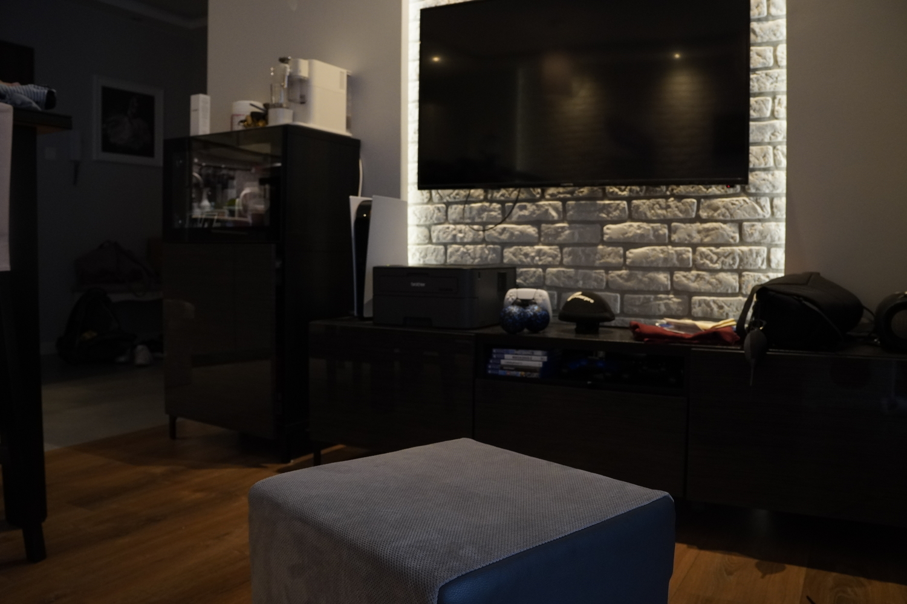
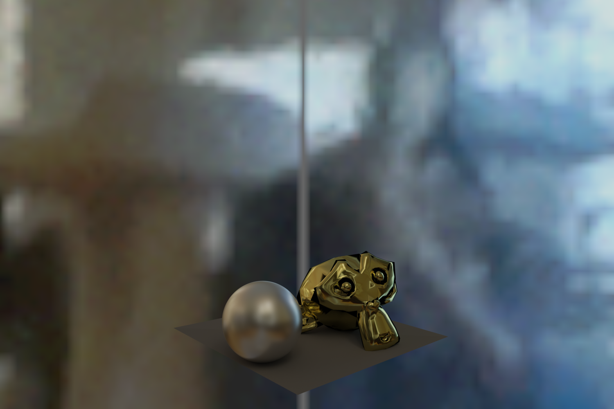

# Image-Based Lighting
This repository encapsulates my project on Image-Based Lighting (IBL), where I investigated the transformation of Low Dynamic Range (LDR) images taken at different exposures into a single High Dynamic Range (HDR) image. The overarching idea was to generate a composite image with a wider range of luminosity and colors, representing more accurately the plethora of light intensities found in natural environments, and render synthetic objects into photographs with accurate lighting.

The overall process of the project followed these general steps:

1. **Capture LDR images at different exposures**: This is the initial step and the foundation of the project. I captured several photographs of the same scene with varying exposure levels. The range of exposures allowed me to later compile a high dynamic range image.

Exposure 1/10          |  Exposure 1/40  |  Exposure 1/160
:-------------------------:|:-------------------------:|:-------------------------:
 |   | 

2. **Recover HDR Radiance Maps**: After acquiring LDR images, I utilized several techniques to merge them into one HDR image. These techniques included naive LDR merging, weighted LDR merging, and LDR merging with the estimation of camera response function. The aim was to create a single image with a broader dynamic range that could better represent the high contrast scenes.

3. **Transform the HDR images**: Using a light probe that was placed on the scene, I transformed the created HDR image into an equirectangular map. This transformation was essential to ensure compatibility with rendering software and to maintain the correct lighting conditions of the original scene in the final render.

Light probe image          |  Computed normals  |  Computed reflections
:-------------------------:|:-------------------------:|:-------------------------:
 |   | 

Computed equirectangular map         |
:-------------------------:|
 |

4. **Render Synthetic Objects into Photographs**: The final stage of the process was rendering synthetic objects into the recovered HDR image. For this, I used Blender 2.8, a versatile 3D creation suite. The equirectangular map served as a light source for the synthetic objects, illuminating them as per the original scene's lighting conditions.

Background image          |  Rendered objects  |  Result image
:-------------------------:|:-------------------------:|:-------------------------:
 |   | 

This project has been a great exploration of image-based lighting and the use of HDR imagery to render realistic synthetic objects. I hope you find this journey as fascinating as I did and that it provides a deeper insight into the intricacies of image-based lighting.

For a more detailed understanding of the project and its outcomes, please refer to the individual sections within the [notebook](https://github.com/OlaPietka/Image-Based-Lighting/blob/main/AnalysisReport.pdf) file and [report](https://github.com/OlaPietka/Image-Based-Lighting/blob/main/ImageBasedLighting.ipynb).
